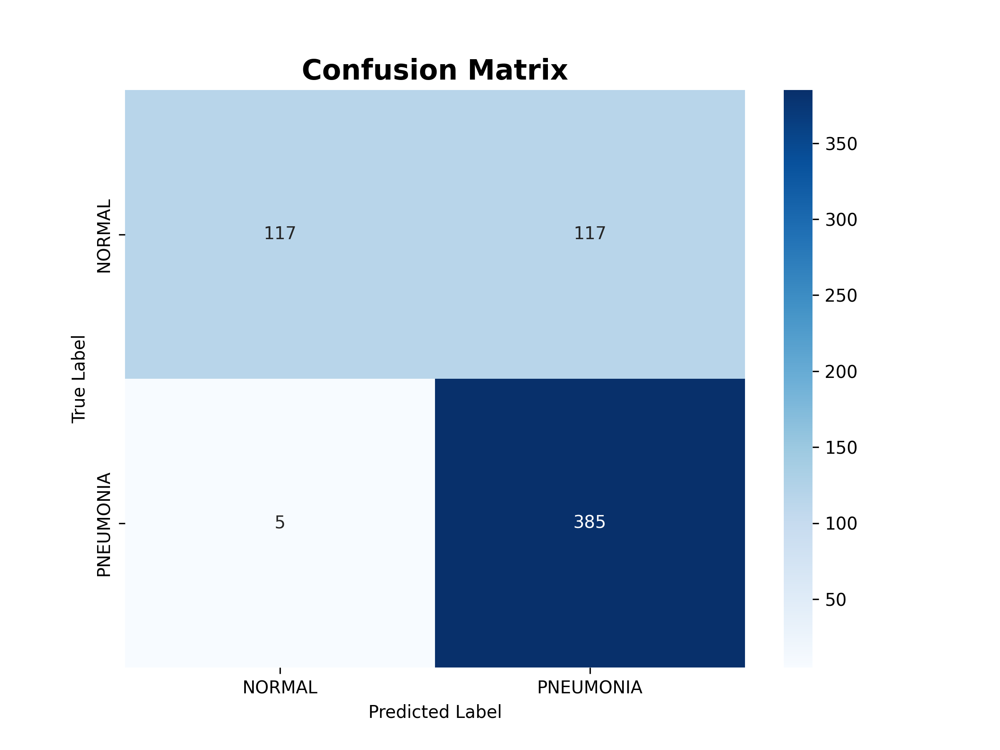
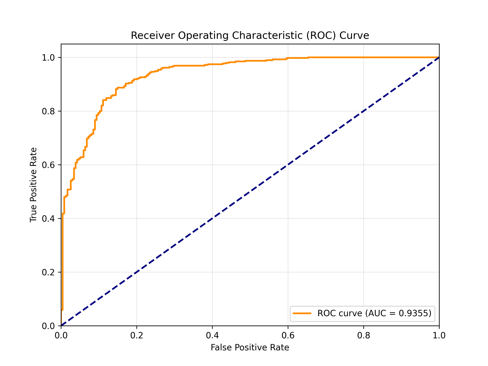
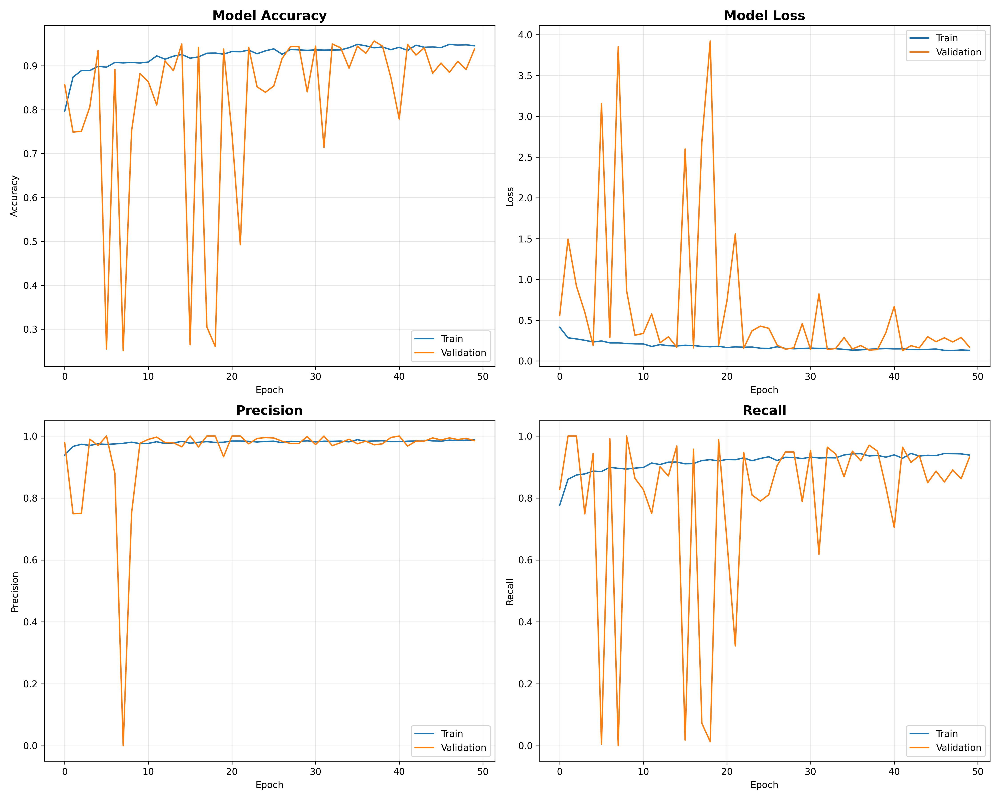
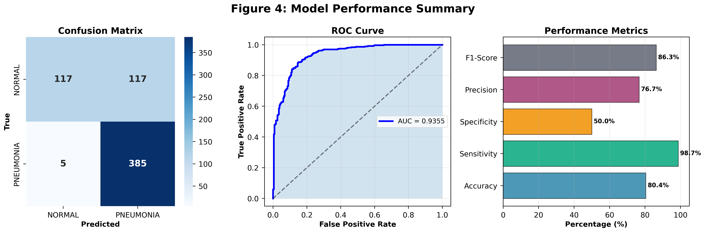

# Pneumonia Detection from Chest X-Ray Images Using Deep Learning

A deep learning-based computer vision system to automatically detect pneumonia from chest X-ray images using transfer learning with ResNet50 architecture.

---

## 📋 Table of Contents
- [About Pneumonia](#about-pneumonia)
- [Project Overview](#project-overview)
- [Dataset Information](#dataset-information)
- [Methodology](#methodology)
- [Project Structure](#project-structure)
- [Installation & Setup](#installation--setup)
- [Usage](#usage)
- [Results](#results)
- [Key Findings](#key-findings)
- [Limitations](#limitations)
- [Future Work](#future-work)
- [References](#references)

---

## 🫁 About Pneumonia

### What is Pneumonia?

Pneumonia is a serious lung infection where the air sacs (alveoli) in one or both lungs become inflamed and fill with fluid or pus [web:11][web:12]. This makes breathing difficult and reduces oxygen supply to the body.

**Common Causes:**
- Bacterial infections (*Streptococcus pneumoniae*, *Haemophilus influenzae*)
- Viral infections (influenza, respiratory syncytial virus)
- Fungal infections (in immunocompromised patients)

**Symptoms Include:**
- High fever (up to 105°F) with chills and sweating
- Productive cough with thick, colored sputum
- Chest pain during breathing or coughing
- Rapid breathing and shortness of breath
- Confusion or altered mental state (especially in elderly patients)

### Pneumonia in India - A Public Health Challenge

Pneumonia remains one of the leading causes of mortality in children under 5 years in India [web:17]. In 2010, approximately **3.6 million episodes** of severe pneumonia and **350,000 deaths** occurred among children under 5 [web:17]. States like Uttar Pradesh, Bihar, Madhya Pradesh, and Rajasthan bear the highest burden [web:17][web:20].

### Why X-Ray Diagnosis?

Chest X-rays are the primary diagnostic tool for pneumonia detection [web:16]. On X-ray images:

- **Normal lungs** appear dark (air-filled) with clear, well-defined structures
- **Pneumonia-affected lungs** show white patches or opacities indicating fluid/pus accumulation in alveoli

These white infiltrates appear as:
- Dense, consolidated areas (bacterial pneumonia)
- Patchy, scattered opacities (bronchopneumonia)
- Ground-glass appearance (viral pneumonia)

However, manual interpretation requires trained radiologists and is time-consuming. This is where AI-assisted diagnosis becomes valuable.

---

## 🎯 Project Overview

This project develops an **automated pneumonia detection system** using deep learning to assist healthcare professionals in faster and more accurate diagnosis. The system analyzes chest X-ray images and classifies them as either **NORMAL** or **PNEUMONIA**.

### Why This Matters

✅ **Speed**: Automated analysis in seconds vs. hours of manual review  
✅ **Accessibility**: Can assist in remote/rural areas lacking specialist radiologists  
✅ **Consistency**: Reduces inter-observer variability in diagnosis  
✅ **Screening Tool**: Helps prioritize critical cases for immediate attention

### What This Project Does

1. Takes a chest X-ray image as input
2. Preprocesses and normalizes the image
3. Passes through a trained ResNet50 neural network
4. Outputs prediction: NORMAL or PNEUMONIA with confidence score
5. Provides interpretable evaluation metrics (confusion matrix, sensitivity, specificity)

---

## 📊 Dataset Information

**Source**: [Chest X-ray Images (Pneumonia) - Paul Mooney, Kaggle](https://www.kaggle.com/datasets/paultimothymooney/chest-xray-pneumonia)

### Dataset Composition

| Split      | NORMAL | PNEUMONIA | Total | Ratio      |
|------------|--------|-----------|-------|------------|
| Training   | 1,341  | 3,875     | 5,216 | 1 : 2.9    |
| Testing    | 234    | 390       | 624   | 1 : 1.7    |
| Validation | 8      | 8         | 16    | 1 : 1      |

**Total Images**: 5,856 chest X-rays

### Data Characteristics

- **Format**: JPEG grayscale images
- **Source**: Pediatric patients (ages 1-5) from Guangzhou Women and Children's Medical Center
- **Acquisition**: Anterior-posterior (AP) chest X-ray views
- **Quality Control**: All images reviewed by expert physicians before training

### Class Imbalance Challenge

The dataset shows significant class imbalance (2.9:1 ratio in training set). This reflects real-world medical scenarios where disease prevalence is often higher in clinical datasets. Our model addresses this through:
- Balanced class weights during training
- Stratified sampling
- Evaluation metrics focused on sensitivity/recall

---

## 🔬 Methodology

### 1. Data Preprocessing

**Image Transformations:**
- Resize to 224×224 pixels (ResNet50 input requirement)
- Normalize pixel values to [0, 1] range
- Convert to RGB format (3 channels)

**Data Augmentation** (Training Set Only):
- Random rotation (±15°)
- Width/height shift (10%)
- Horizontal flip
- Zoom (10%)

> **Note**: Augmentation is NOT applied to validation/test sets to maintain evaluation integrity.

### 2. Model Architecture

**Base Model**: ResNet50 (Residual Network with 50 layers)

**Transfer Learning Strategy:**
- Load ResNet50 pre-trained on ImageNet (1.2M images, 1000 classes)
- Freeze initial layers (generic feature extractors)
- Fine-tune last 10 layers (domain-specific features)
- Add custom classification head:
  - Global Average Pooling
  - Dense layer (256 units, ReLU)
  - Dropout (0.5)
  - Dense layer (128 units, ReLU)
  - Dropout (0.3)
  - Output layer (1 unit, Sigmoid) → Binary classification

**Why ResNet50?**
- Proven performance on medical imaging tasks
- Residual connections prevent vanishing gradients in deep networks
- Transfer learning compensates for limited medical training data
- Computationally efficient compared to deeper architectures

### 3. Training Configuration

| Parameter              | Value                      |
|------------------------|----------------------------|
| Optimizer              | Adam (lr=0.0001)           |
| Loss Function          | Binary Cross-Entropy       |
| Batch Size             | 32                         |
| Epochs                 | 50 (with early stopping)   |
| Class Weights          | Balanced (computed)        |
| Early Stopping         | Patience=10 (val_loss)     |
| Learning Rate Reduction| Factor=0.5, Patience=5     |

### 4. Evaluation Metrics

Standard accuracy is **insufficient** for medical diagnosis. We prioritize:

**Primary Metrics:**
- **Recall (Sensitivity)**: Ability to detect all pneumonia cases
- **Precision**: Accuracy of positive predictions
- **F1-Score**: Harmonic mean of precision and recall

**Clinical Metrics:**
- **Specificity**: Correctly identifying healthy patients
- **False Negative Rate**: Missing pneumonia cases (most dangerous)
- **False Positive Rate**: Misdiagnosing healthy patients

**Visualization:**
- Confusion Matrix

- ROC Curve with AUC score

- Training/Validation accuracy & loss curves

---
